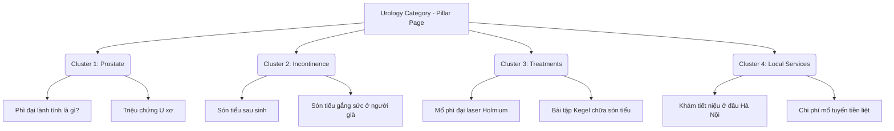

# Comprehensive General Hospital SEO Plan: Prostate & Urinary Incontinence

This document outlines the overall SEO & content strategy blueprint designed to establish a General Hospital as a market leader in Urology, specifically targeting **Prostate Diseases (Tuyến tiền liệt)** and **Urinary Incontinence (Són tiểu)**. Use this structure to pitch clinical clients and demonstrate a deep understanding of their patients' psychology.

---

## 🧠 1. Target Audience Psychology & Content Tone

To convert readers into patients, content must speak to their distinct emotional triggers and fears.

### A. Prostate Disease (Tuyến Tiền Liệt)
*   **Target Group:** Middle-aged & elderly men (45+ years old).
*   **Psychological Triggers:** Anxiety about sexual dysfunction (erectile issues, loss of masculinity), fear of painful surgeries, dread of prostate cancer.
*   **Tone of Voice:**
    *   **Authoritative & Scientific:** Use clear medical facts, statistics, and logical explanations.
    *   **Decisive & Reassuring:** Clearly state treatment outcomes, survival rates for urological procedures, and safety measures.
    *   **Actionable:** Tell them exactly what to do next without beating around the bush.

### B. Urinary Incontinence (Són Tiểu / Tiết Niệu)
*   **Target Group:** Postpartum women (young to middle-aged) and the elderly.
*   **Psychological Triggers:** Deep embarrassment, shame, isolation, fear of odor in public, reluctance to talk even to family.
*   **Tone of Voice:**
    *   **Deeply Empathetic & Warm:** Open with compassionate statements recognizing their daily struggles. Normalise the condition (e.g., "70% of postpartum women experience this; you are not alone").
    *   **Gentle & Reassuring:** Focus on non-invasive treatments, lifestyle remedies (Kegel), and easy, private clinic appointments.
    *   **Discreet:** Assure them of complete medical privacy and supportive staff.

---

## 🗂️ 2. Topic Clusters & Silo Architecture

Organize the website content into five strong, structured clusters to build "Topical Authority" in Google's eyes.

### Cluster 1: Prostate Pathology (Bệnh lý Tuyến tiền liệt)
*   **Pillar Page:** "Bệnh Tuyến Tiền Liệt: Triệu chứng, Nguyên nhân & Các phương pháp điều trị hiệu quả"
*   **Sub-topics (Long-tail):**
    *   Phì đại tuyến tiền liệt kích thước bao nhiêu là nguy hiểm? (Focus on specific metrics, e.g., 30g, 40g, 80g)
    *   Viêm tuyến tiền liệt mãn tính có chữa dứt điểm được không?
    *   Tự kiểm tra dấu hiệu ung thư tuyến tiền liệt tại nhà bằng cách nào?

### Cluster 2: Urinary Incontinence & Bladder (Són tiểu & Đường tiết niệu)
*   **Pillar Page:** "Chứng Són Tiểu (Tiểu không tự chủ): Nguyên nhân & Cách điều trị dứt điểm"
*   **Sub-topics (Long-tail):**
    *   Són tiểu sau sinh mổ/sinh thường uống thuốc gì tốt?
    *   Nguyên nhân són tiểu khi ho, hắt hơi, cười lớn ở phụ nữ
    *   Cách khắc phục tiểu đêm, tiểu són ở người già tại nhà hiệu quả

### Cluster 3: Diagnostics & Medical Procedures
*   **Pillar Page:** "Các kỹ thuật chẩn đoán và xét nghiệm Ngoại Tiết Niệu"
*   **Sub-topics (Long-tail):**
    *   Chỉ số xét nghiệm PSA là gì? Khi nào cần xét nghiệm tầm soát ung thư?
    *   Quy trình siêu âm tuyến tiền liệt ngả trực tràng diễn ra thế nào? Có đau không?

### Cluster 4: Treatments & Surgical Procedures (High Commercial Intent)
*   **Pillar Page:** "Các phương pháp ngoại khoa tiên tiến điều trị bệnh Tiết Niệu"
*   **Sub-topics (Long-tail):**
    *   Mổ bóc u xơ tuyến tiền liệt bằng laser Holmium (HoLEP) có ưu điểm gì?
    *   Nên mổ nội soi hay mổ hở u xơ tuyến tiền liệt? So sánh chi phí.
    *   Hướng dẫn tập bài tập Kegel chữa són tiểu cho phụ nữ sau sinh chuẩn y khoa

### Cluster 5: Local SEO & Conversions (Transactional)
*   **Landing Page 1:** "Phòng Khám / Bệnh Viện Điều Trị Tuyến Tiền Liệt Uy Tín Tại Hà Nội"
*   **Landing Page 2:** "Địa Chỉ Khám Són Tiểu và Tiểu Không Tự Chủ Tốt Nhất Tại TP.HCM"

---

## ⚡ 3. UX & Conversion Rate Optimization (CRO) for Medical Sites

To turn visitors into booked patients, the website structure must adapt to their specific situations:

1.  **The "Urgency Hotline" Anchor:** For acute symptoms (e.g. "bí tiểu cấp cứu" - acute urinary retention), place an immediate floating **Call Hotline** button or **Emergency Directions** map.
2.  **Anonymous / Discreet Booking Widget:** For sensitive topics like urinary incontinence or male sexual health, offer an anonymous booking form where they can just leave a phone number/Zalo for a private call-back.
3.  **Visible Credential Cards (E-E-A-T):** At the top and bottom of every article, show a doctor badge: *"Bài viết được tham vấn chuyên môn bởi PGS.TS.BS [Tên Bác Sĩ] - Trưởng khoa Ngoại Tiết niệu."* Link to the doctor's full profile showcasing achievements, certificates, and reviews.
4.  **Before/After & Recovery Stories:** Real, emotional testimonials from patients who recovered from prostate surgery or chronic incontinence (keeping names anonymous if requested, e.g., "Chú H. 62 tuổi, Hà Nội").
